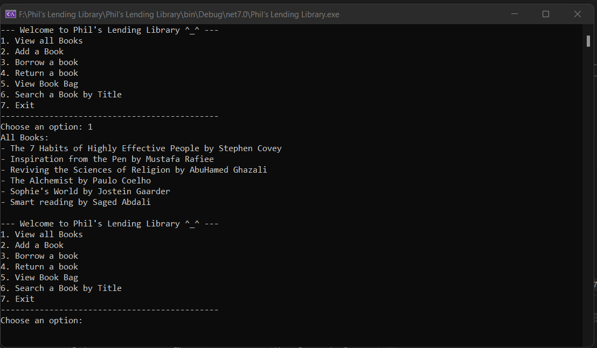

# Phil’s Lending Library

## Summary

Phil's Lending Library is a console application that emulates a lending library. It offers various functionalities such as adding books, searching for books, borrowing books, returning books, and storing borrowed books in a backpack. This application presents a straightforward and interactive interface for efficient management of the library's book collection.

## Visuals
Here's an example how Phil's Lending Library work:

## Usage

To use Phil's Lending Library:

1- Launch the application by cloning the project, opening it in Visual Studio, and running it.

2- Choose from the menu options:

- View all Books
- Add a Book
- Borrow a Book
- Return a Book
- View Book Bag
- Search a Book by Title
- Exit

3- Select an option by entering the corresponding number.

4- Follow the on-screen instructions to complete the action.

5- Continue using the application by selecting different menu options.
